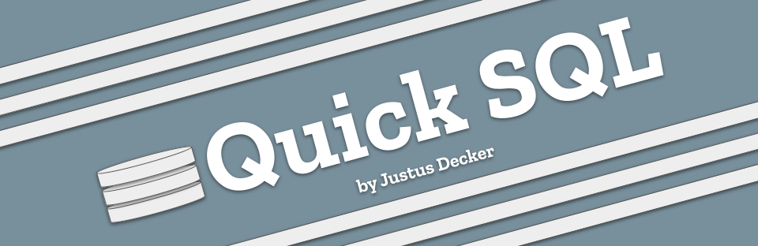
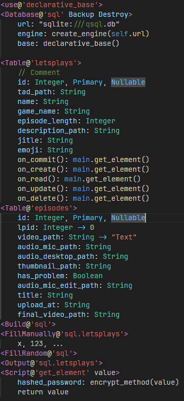

# QuickSQL



QSQL is a SQL Template Scripting Language that converts a simple Template to Python-SQLAlchemy compatible code, with Accessor etc.

work in progress

## Features

* Syntax-highlighting for `.sq` files
* The `.sq` to `.py` Converter

## Documentation



### Core Syntax & Structure

The language uses a tag-based system for defining blocks and a key-value system for attributes.

* Blocks: Defined by angle brackets `<Tag@'Identifier' Options>`.

* Comments: Single-line comments start with `//`.

* Indentation: Content inside tags is indented to denote scope.

* Strings: Must be enclosed in double quotes (e.g., `"sqlite:///qsql.db"`).

### Global Imports (`<use@>`)

The <use@'module'> tag is used to import python dependencies required for the script's execution environment.

Example: `<use@'sqlalchemy.declarative_base'>` loads the standard ORM mapping base.

### Database Configuration (`<Database@>`)

Defines the connection and behavior of the data store.

* Identifier: Usually the driver type (e.g., 'sql').

* Flags: Optional parameters like Backup (auto-backup) or Destroy (drop existing data on start).

* Required Attributes:

    * url: The connection string.

    * engine: The initialization command for the DB driver.

    * base: The declarative base for tables.

### Table Definitions (`<Table@>`)

Defines the schema for a database table. Columns are defined line-by-line using the following syntax: `name: Type, [Modifiers] [-> DefaultValue]`

|Feature|Syntax|Description|
|---|---|---|
|Type|`Integer, String, Boolean`|Defines the data type.
|Modifiers|`Primary, Nullable`|Defines constraints (Primary Key, allows Null).
|Default Value|`-> value`|Assigns a default value if none is provided.

#### Event Hooks

Tables support lifecycle hooks using the fat arrow => syntax:

* on_commit: Executes after data is saved.
* on_read: Executes when data is queried.
* on_create: Executes on row insertion.
* on_delete: Executes on row removal.
* on_update: Executes on row update.

### Execution & Data Commands

These tags perform actions based on the defined schemas.

* `<Build@'sql'>`: Compiles the schema and creates the physical tables in the database.

* `<FillManually@'table'>`: Starts a manual data entry block. Values are comma-separated.

* `<FillRandom@'sql'>`: Automatically populates tables with dummy data for testing.

* `<Output@'table'>`: Fetches and displays the contents of the specified table.

### Functional Scripting (`<Script@>`)

Defines logic or transformations that can be applied to data.

* Syntax: `<Script@'name' parameter>`

* Logic: Can include function calls and variable assignments.

* Return: Uses the return keyword to pass a value back to the caller.

Example:

```
<Script@'get_element' value>
    hashed_password: encrypt_method(value)
    return value
```

### Operators

|Operator|Usage|
|---|---|
|:|Assigns a type or value to a property.|
|@|Defines the scope or identifier of a tag.|
|->|Assigns a default value to a column.|
|=>|Maps a trigger/hook to a specific function.|
|,|Separates modifiers or list values.|


Licensed under [MIT](./LICENSE).